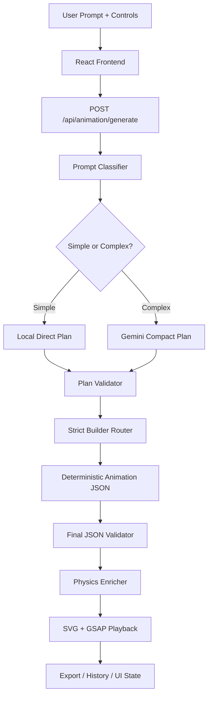
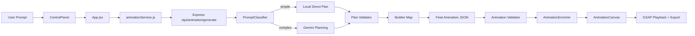

# 🚀 AI 2D Animation Generator

## 📌 Overview

This project is a full-stack prompt-to-animation system that turns natural language into validated 2D animation scenes.

What it does:
- Accepts a text prompt plus a few visual controls from the browser
- Classifies the prompt locally to decide whether it is simple or complex
- Uses Gemini only when the prompt is complex enough to need planning
- Builds the final animation JSON deterministically in backend code
- Validates the final scene, enriches motion with physics, and renders it in the browser

Problem it solves:
- Traditional animation creation is slow and manual
- Most prompt-based systems fail when the AI is asked to generate a full scene object directly
- This project reduces that risk by making Gemini produce compact plans, not the final scene structure

Real-world use cases:
- Rapid animation prototyping for product demos
- Learning animation data structures and motion systems
- Generating simple motion graphics without hand-authoring SVG timelines
- Testing AI-assisted creative workflows with deterministic backend safeguards

---

## 🎯 Objectives

The system is designed to achieve a few concrete goals:

- Convert plain English prompts into valid 2D animation scenes
- Minimize dependency on Gemini for simple prompts
- Keep the final animation structure deterministic and validator-safe
- Support repeatable builder routing based on a strict `plan.type`
- Add physics-based motion enrichment after the scene is already valid
- Provide runtime visibility through in-memory metrics and local audit scripts

Technically, the project aims to:
- Separate intent planning from animation structure generation
- Keep prompt handling lightweight and deterministic where possible
- Use local code for layout, timing, and element generation
- Maintain a small API surface with a single generate endpoint
- Keep the browser as a renderer and player, not the source of truth for scene logic

---

## 🧠 Core Concept

The main idea is simple:

1. The user describes an animation in plain language.
2. The backend classifies the prompt into a specific animation type.
3. Simple prompts are handled locally.
4. Complex prompts go to Gemini for a tiny plan object.
5. The builder layer turns that plan into the final animation JSON.
6. Validation and physics enrichment happen after the scene exists.

This matters because the project does not trust the model to create the final structure.

Instead of asking Gemini for a huge nested animation object, the backend asks for a compact intent plan such as:
- scene type
- subject
- motion
- style
- complexity

Then the code decides:
- how many elements to create
- where to place them
- what animation timelines to attach
- how to keep output small and valid

That is the core architectural shift in this codebase.

---

## 🏗️ System Architecture

The system is split into three practical layers:

- Frontend presentation and playback
- Backend planning, validation, and scene building
- Physics and utility support modules

### High-Level View



### Architecture Notes
- `server.js` is the Express bootstrap and API host
- `animationController.js` is the orchestration layer
- `PromptClassifier.js` decides the route before Gemini is used
- `geminiService.js` creates compact plans only for complex prompts
- `buildAnimationFromPlan.js` maps `plan.type` to concrete builders
- Builder templates create the final animation scene deterministically
- `AnimationEnricher.js` optionally upgrades motion after validation
- The frontend only renders and plays the JSON it receives

---

## 📂 Folder & File Structure

### Complete Project Tree

```text
ANIMATION_ENGINE/
├── .gitignore
├── README.md
├── documentation.md
├── LLM_TO_BUILDER_REFACTOR_GUIDE.md
├── backend/
│   ├── .env.example
│   ├── package.json
│   ├── package-lock.json
│   ├── server.js
│   ├── temp.js
│   ├── builders/
│   │   ├── buildAnimationFromPlan.js
│   │   ├── builderUtils.js
│   │   └── templates/
│   │       ├── abstractSceneBuilder.js
│   │       ├── advancedChartSceneBuilder.js
│   │       ├── basicShapeBuilder.js
│   │       ├── bounceSceneBuilder.js
│   │       ├── candlestickBuilder.js
│   │       ├── chartAdvancedBuilder.js
│   │       ├── flowBuilder.js
│   │       ├── floatSceneBuilder.js
│   │       ├── multiBuilder.js
│   │       ├── multiSubjectSceneBuilder.js
│   │       ├── orbitBuilder.js
│   │       ├── particleExplosionBuilder.js
│   │       ├── particleFlowFieldBuilder.js
│   │       ├── skylineBuilder.js
│   │       ├── skylineSceneBuilder.js
│   │       └── textBuilder.js
│   ├── controllers/
│   │   └── animationController.js
│   ├── physics/
│   │   ├── MotionSolver.js
│   │   ├── OrbitalMechanics.js
│   │   ├── ParticleSystem.js
│   │   ├── PhysicsEngine.js
│   │   ├── Vector2D.js
│   │   └── WaveGenerator.js
│   ├── processors/
│   │   ├── AnimationEnricher.js
│   │   ├── KeyframeOptimizer.js
│   │   ├── PromptClassifier.js
│   │   └── SceneAnalyzer.js
│   ├── routes/
│   │   └── animationRoutes.js
│   ├── schema/
│   │   └── animationPlanSchema.js
│   ├── services/
│   │   └── geminiService.js
│   ├── utils/
│   │   ├── MathUtils.js
│   │   └── metrics.js
│   └── validators/
│       ├── animationPlanValidator.js
│       └── animationValidator.js
├── docs/
│   ├── images/
│   │   ├── SS1.png
│   │   ├── SS2.png
│   │   └── SS3.png
│   └── video/
│       └── video_20260227_160137.mp4
├── frontend/
│   ├── index.html
│   ├── package.json
│   ├── package-lock.json
│   ├── postcss.config.js
│   ├── tailwind.config.js
│   ├── vite.config.js
│   └── src/
│       ├── App.jsx
│       ├── index.css
│       ├── main.jsx
│       ├── components/
│       │   ├── AnimationCanvas.jsx
│       │   ├── ControlPanel.jsx
│       │   ├── JSONInputPanel.jsx
│       │   ├── StatusPanel.jsx
│       │   └── TopNav.jsx
│       └── services/
│           └── animationService.js
└── scripts/
    └── evaluateSystem.js
```

### What Each Major Folder Does

#### `backend/`
The server-side animation pipeline.

#### `backend/builders/`
Converts compact plans into full animation scenes.

#### `backend/processors/`
Contains prompt analysis, enrichment, and scene interpretation logic.

#### `backend/physics/`
Reusable physics solvers and path generators for motion upgrades.

#### `backend/validators/`
Ensures both the compact plan and final animation JSON are structurally valid.

#### `backend/services/`
External service integration, currently Gemini plan generation.

#### `backend/utils/`
Shared helper functions and runtime metrics.

#### `frontend/`
The React/Vite UI that collects prompts, shows the canvas, and handles playback.

#### `docs/`
Screenshots and demo assets used for documentation and presentation.

#### `scripts/`
Manual evaluation harnesses for classifier and builder coverage.

---

## ⚙️ Working Flow (Step-by-Step)

### Request Flow

1. The user opens the app and enters a prompt in the left panel.
2. The frontend merges prompt text with selected controls like shape, color, speed, and duration.
3. The frontend sends `POST /api/animation/generate` to the backend.
4. The Express server validates request size and passes the request to the animation controller.
5. `PromptClassifier.js` analyzes the prompt and returns a deterministic result with:
   - `type`
   - `complexity`
   - supporting flags such as text, particles, and skyline detection
6. If the prompt is simple, the controller creates a local plan without calling Gemini.
7. If the prompt is complex, the controller calls `geminiService.generateAnimationPlan()` to get a compact planning object.
8. The plan is validated before any builder runs.
9. `buildAnimationFromPlan.js` selects the correct builder from a strict map.
10. The selected builder creates the final animation JSON deterministically.
11. The final JSON is validated.
12. `AnimationEnricher.js` optionally improves motion paths or particle motion.
13. The controller returns `{ animation: finalJSON }`.
14. The frontend renders the SVG scene and plays the animation using GSAP.
15. The user can scrub, restart, pause, and export the animation as WebM.

### Important Behavior
- Simple prompts avoid Gemini entirely
- Complex prompts may use Gemini, but only for planning
- The final scene structure always comes from backend code
- Fallback behavior is visible and audited through logs and metrics

---

## 🔍 Deep Code Breakdown

### Backend Entry Points

#### `backend/server.js`
What it does:
- Loads environment variables
- Enables CORS
- Parses JSON requests with a 50kb limit
- Exposes `/health`
- Mounts `/api/animation`
- Returns 404 for unknown routes
- Installs global error and process-level safety handlers

Why it exists:
- It is the application bootstrap and the server boundary

How it interacts:
- Imports the route module and delegates actual animation work to the controller

#### `backend/routes/animationRoutes.js`
What it does:
- Registers `POST /generate`

Why it exists:
- Keeps route definition separate from orchestration logic

How it interacts:
- Passes requests directly to `animationController.generateAnimation`

#### `backend/controllers/animationController.js`
What it does:
- Validates request fields
- Normalizes prompt text
- Classifies prompt type and complexity
- Decides whether Gemini is needed
- Validates plans and output
- Applies requested duration scaling
- Runs final physics enrichment
- Tracks metrics and prints snapshots

Why it exists:
- This is the orchestration layer that ties the whole backend together

How it interacts:
- Uses `PromptClassifier` for route choice
- Uses `geminiService` for complex planning
- Uses `buildAnimationFromPlan` for deterministic scene generation
- Uses both validators and the enricher before responding

---

### Prompt Analysis Layer

#### `backend/processors/PromptClassifier.js`
What it does:
- Normalizes prompts
- Extracts quoted text
- Detects subject types and motion types
- Classifies prompts into types such as `basic_shape`, `bounce`, `float`, `particles`, `flow`, `skyline`, `multi`, `candlestick`, `chart_advanced`, `orbit`, `text`, or `unknown`
- Returns a `complexity` of `simple` or `complex`
- Logs the classified type

Why it exists:
- It is the decision point that reduces Gemini usage and makes routing deterministic

How it interacts:
- Feeds the controller route decision
- Provides fallback plan creation through `createIntentPlan()`
- Shares subject and color detection logic with builders

#### `backend/processors/SceneAnalyzer.js`
What it does:
- Analyzes animation JSON and prompt composition hints
- Helps infer subject count, motion type, and whether a prompt contains text, particles, skyline, or composite language

Why it exists:
- Supports prompt interpretation and scene analysis for richer heuristics

How it interacts:
- Used by the classifier for composition-aware decision making

#### `backend/processors/AnimationEnricher.js`
What it does:
- Enhances validated animation JSON with physics-driven keyframes when applicable
- Leaves the original output unchanged if enrichment fails

Why it exists:
- Adds richer motion without making the generation pipeline fragile

How it interacts:
- Runs after validation and before the final response is returned

#### `backend/processors/KeyframeOptimizer.js`
What it does:
- Reduces redundant or overly dense keyframes

Why it exists:
- Keeps animation timelines compact and manageable

How it interacts:
- Used as a support utility inside the enrichment pipeline

---

### Gemini Planning Layer

#### `backend/services/geminiService.js`
What it does:
- Builds a compact prompt for Gemini
- Requests a small animation plan, not the final JSON
- Parses provider output safely
- Sanitizes scene type, subject, motion, and style fields
- Retries on retryable provider errors
- Caches plans and fallback results
- Returns fallback metadata such as `_fallbackUsed` and `_fallbackReason`

Why it exists:
- Gemini is used for intent planning only, which is much safer than asking it for full scene output

How it interacts:
- Called by the controller only when the prompt is complex
- Returns a plan that the builder layer can turn into final JSON

---

### Builder Layer

#### `backend/builders/buildAnimationFromPlan.js`
What it does:
- Defines the strict `BUILDER_MAP`
- Validates that `plan.type` exists
- Allows `abstractSceneBuilder` only for `unknown`
- Logs `PLAN_TYPE` and `BUILDER_SELECTED`
- Throws on unknown plan types
- Calls the chosen builder with shared utilities and physics modules

Why it exists:
- It is the core deterministic routing layer that replaces fuzzy or silent builder selection

How it interacts:
- Receives validated plans from the controller
- Dispatches to the correct template builder
- Logs builder usage for metrics and audit scripts

#### `backend/builders/builderUtils.js`
What it does:
- Provides `createPromptHash()` for deterministic hashing
- Provides `getVariantFromPrompt()` for stable variant selection
- Provides `clamp()`, `lerp()`, `slugify()`, and `createScene()`

Why it exists:
- These helpers keep builder code consistent and lightweight

How it interacts:
- Used across builders for layout, variants, naming, and final scene creation

---

### Builder Templates

#### `basicShapeBuilder.js`
- Builds a single circle or rectangle scene
- Supports spin, bounce, pulse, fade, and reveal style motion
- Uses prompt or subject data to decide geometry and motion style

#### `orbitBuilder.js`
- Builds a simple star-and-planet orbit scene
- Uses orbital mechanics and motion solver helpers to create keyframes

#### `textBuilder.js`
- Builds a title or quoted text reveal scene
- Supports fade or move-based reveal animations

#### `bounceSceneBuilder.js`
- Builds a deterministic gravity bounce scene
- Uses the physics engine to simulate the motion path

#### `floatSceneBuilder.js`
- Builds a smooth floating motion scene
- Uses wave-based path generation

#### `particleExplosionBuilder.js`
- Builds a particle burst with multiple circle elements
- Uses `ParticleSystem` to generate deterministic particle histories
- Creates fade and movement timelines from particle paths

#### `particleFlowFieldBuilder.js`
- Builds flowing particle lanes driven by wave paths
- Uses wave generation and motion keyframes for repeated flow motion

#### `multiSubjectSceneBuilder.js`
- Places multiple subjects based on role and variant
- Supports text, shapes, and particles in one scene

#### `skylineSceneBuilder.js`
- Builds a skyline with buildings, accents, and optional title text
- Uses deterministic building heights and palette selection

#### `advancedChartSceneBuilder.js`
- Builds a chart/dashboard style scene with bars, axis, and title
- Useful for chart-like prompts and data-themed scenes

#### `candlestickBuilder.js`
- Builds candle-bar style financial scenes
- Uses variant-based palette and candle layouts

#### `abstractSceneBuilder.js`
- Acts as the fallback scene builder for unknown prompts
- Prioritizes subject roles and builds a generalized abstract composition

---

### Validation Layer

#### `backend/validators/animationPlanValidator.js`
What it does:
- Validates compact plans before a builder runs
- Checks version, scene type, subject, motion, style, and secondary subject constraints
- Logs validation failures and increments metrics

Why it exists:
- Prevents invalid or malformed plans from reaching the builder layer

How it interacts:
- Used by both Gemini-backed and locally created plans

#### `backend/validators/animationValidator.js`
What it does:
- Validates the final animation scene object
- Checks canvas, elements, and timeline structure

Why it exists:
- Ensures the final response is safe for the frontend renderer

How it interacts:
- Runs after build, before enrichment and response

---

### Physics Layer

#### `backend/physics/PhysicsEngine.js`
What it does:
- Provides gravity bounce, spring, pendulum, and projectile simulations

Why it exists:
- Adds realistic motion models for scene builders and enrichment

#### `backend/physics/OrbitalMechanics.js`
What it does:
- Generates orbit-related motion paths

#### `backend/physics/WaveGenerator.js`
What it does:
- Generates wave, float, spiral, and other path families

#### `backend/physics/ParticleSystem.js`
What it does:
- Generates particle burst, float, and rain simulations

#### `backend/physics/MotionSolver.js`
What it does:
- Converts sampled positions into keyframes for animation timelines

#### `backend/physics/Vector2D.js`
What it does:
- Immutable vector math utility used by the physics modules

---

### Frontend Layer

#### `frontend/src/App.jsx`
What it does:
- Owns application state
- Merges prompt and controls into a single backend request description
- Stores generated animation data and history

Why it exists:
- It is the top-level React shell for the app

How it interacts:
- Passes props into `ControlPanel`, `TopNav`, and `AnimationCanvas`
- Calls the API service when the user clicks Generate

#### `frontend/src/components/ControlPanel.jsx`
What it does:
- Captures prompt, speed, shape, color, and duration
- Shows suggestions and generation status
- Stores local history tab items

Why it exists:
- It is the primary user input surface

How it interacts:
- Calls `onGenerate()` with the current prompt payload
- Calls `onSelectHistory()` when history items are clicked

#### `frontend/src/components/AnimationCanvas.jsx`
What it does:
- Renders the scene as SVG
- Creates and controls a GSAP master timeline
- Supports play, pause, restart, scrubbing, and WebM export

Why it exists:
- It is the visual playback engine

How it interacts:
- Reads `animationData` and builds a timeline from `animationData.timeline`
- Serializes the SVG into a canvas for browser-side export

#### `frontend/src/components/TopNav.jsx`
What it does:
- Shows app branding and status chips for idle, loading, success, and error states

Why it exists:
- Gives the UI a consistent status header and branding area

#### `frontend/src/services/animationService.js`
What it does:
- Sends a POST request to `/api/animation/generate`

Why it exists:
- Keeps HTTP logic out of React components

---

## 🔗 Data Flow Diagram



---

## 🧩 Key Features

| Feature | Technical implementation |
|---|---|
| Prompt classification | `PromptClassifier.js` analyzes prompt keywords, subject hints, motion hints, and composition clues |
| Simple-route bypass | Simple prompts create direct local plans without calling Gemini |
| Gemini planning | `geminiService.js` returns compact plans only for complex prompts |
| Strict builder routing | `buildAnimationFromPlan.js` maps exact `plan.type` values to builders |
| Deterministic variants | `builderUtils.getVariantFromPrompt()` selects stable variants using a hash |
| Physics enrichment | `AnimationEnricher.js` expands motion after validation |
| Validation safety | Separate validators for plan and final animation JSON |
| Metrics | `utils/metrics.js` tracks requests, Gemini calls, fallbacks, failures, and builder usage |
| Auditability | `backend/temp.js` and `scripts/evaluateSystem.js` exercise routing and report coverage |
| Frontend playback | `AnimationCanvas.jsx` converts JSON into GSAP timelines and SVG output |

### Notable Runtime Behavior
- `unknown` plan type is the only case where the abstract scene builder is allowed as a fallback
- Builders print `BUILDER_USED` logs for auditability
- The controller prints metrics snapshots after requests
- The system favors valid local output over waiting for Gemini whenever possible

---

## 🛠️ Tech Stack

| Technology | Purpose |
|---|---|
| Node.js | Backend runtime |
| Express 4 | HTTP API server |
| CORS | Cross-origin browser access during development and production |
| dotenv | Environment variable loading |
| Gemini API | Compact intent planning for complex prompts |
| React 18 | Frontend UI |
| Vite 5 | Frontend dev server and build tool |
| GSAP 3 | Animation playback and timeline control |
| Axios | Frontend HTTP client |
| Tailwind CSS 3 | Utility CSS integration |
| PostCSS + Autoprefixer | CSS processing |
| MediaRecorder | Browser-side WebM export |
| Mermaid | Documentation diagrams |

---

## ⚡ Design Decisions & Trade-offs

### 1) Gemini is used for planning, not final structure
This reduces token pressure, JSON truncation risk, and malformed output risk.

### 2) Builders own final scene generation
That keeps scene shape, timing, ids, and element counts deterministic.

### 3) Simple prompts skip Gemini entirely
This improves latency and reduces provider load.

### 4) Fallbacks are explicit
Unknown or failed paths are not hidden. They are logged and counted.

### 5) Validation happens twice
- Once for the compact plan
- Once for the final animation output

### 6) In-memory metrics are intentionally lightweight
This is fast and simple, but not durable across process restarts.

### 7) The frontend is a renderer, not a generator
That keeps the browser logic focused on playback, export, and display.

### Limitations / Assumptions
- No database or persistent storage exists
- Metrics reset on restart
- Legacy frontend components still exist but are not mounted
- Documentation and runtime naming are not perfectly aligned in every place
- Some UI controls are merged into the description string but are not all consumed directly by the backend

---

## 🚧 Challenges Solved

| Challenge | How the project addresses it |
|---|---|
| Large or truncated LLM JSON | Gemini now returns only a compact plan |
| Too many Gemini calls | Simple prompts bypass Gemini completely |
| Hidden fallback behavior | Fallbacks are logged and counted explicitly |
| Builder ambiguity | `BUILDER_MAP` enforces strict type-to-builder routing |
| Invalid scene output | Final animation JSON is validated before response |
| Slow or brittle motion generation | Physics enrichment is post-processing, not generation-critical |
| Unclear runtime behavior | Audit scripts print classification, builder usage, and fallback behavior |

---

## 🧪 Example Usage

### Example 1: Simple Prompt
Input:
```text
A red square spinning continuously
```

Expected behavior:
- Classifier returns a simple type such as `basic_shape` or `bounce`
- Gemini is skipped
- Local plan is created
- `basicShapeBuilder` generates the scene
- Output is validated and rendered

### Example 2: Orbit Prompt
Input:
```text
A blue planet orbiting a bright yellow star
```

Expected behavior:
- Classifier returns `orbit`
- Gemini is skipped because the prompt is simple and known
- `orbitBuilder` builds the orbit scene
- Browser renders a planet moving around the star

### Example 3: Complex Creative Prompt
Input:
```text
A cinematic futuristic city with floating neon particles
```

Expected behavior:
- Classifier returns a complex route such as `multi`, `skyline`, or similar depending on prompt composition
- Gemini creates a compact plan if the route is complex
- Builder turns the plan into a deterministic scene
- Final output is validated and enriched

### Example 4: Audit Harness
Run:
```bash
cd backend
node temp.js
```

What it prints:
- detected prompt type
- selected builder
- Gemini usage
- fallback usage
- plan validation and output validation results
- builder usage summary

---

## ▶️ Setup & Installation

### Prerequisites
- Node.js 18 or newer
- npm
- A Gemini API key for complex prompt planning

### Backend Setup
```bash
cd backend
npm install
```

Create `backend/.env`:
```env
GEMINI_API_KEY=your_gemini_api_key
PORT=5000
NODE_ENV=development
# optional tuning values
GEMINI_MODEL=gemini-2.5-flash
GEMINI_TIMEOUT_MS=60000
GEMINI_MAX_RETRIES=2
GEMINI_PLAN_MAX_OUTPUT_TOKENS=256
GEMINI_PLAN_TEMPERATURE=0.1
GEMINI_TOP_P=0.7
```

Run the backend:
```bash
npm run dev
```

### Frontend Setup
```bash
cd frontend
npm install
npm run dev
```

### Optional Audit Script
```bash
cd backend
node temp.js
```

### Optional Larger Evaluation Script
```bash
node scripts/evaluateSystem.js
```

### Useful URLs
- Frontend: http://localhost:5173
- Backend health: http://localhost:5000/health
- Generate API: http://localhost:5000/api/animation/generate

---

## 📊 Visual Enhancements

This documentation intentionally uses:
- tables for quick scanning
- Mermaid diagrams for architecture clarity
- short bullet points for dense technical sections
- code snippets for setup and examples
- emoji section headers for visual hierarchy

---

## 🔮 Future Improvements

| Improvement | Why it would help |
|---|---|
| Automated tests | Would make routing and builder regressions easier to catch |
| Persisted metrics | Would make performance and usage tracking survive restarts |
| Unified naming cleanup | Would reduce mismatch between docs, builders, and UI copy |
| UI control-to-backend mapping | Would make speed/shape/color controls more meaningful in the backend request |
| Stronger schema versioning | Would simplify future changes to the planning contract |
| More template builders | Would expand the library of deterministic scenes |
| Export hardening | Would make WebM export more robust across browsers |
| Code cleanup for legacy components | Would remove stale UI files that are no longer mounted |
| Centralized documentation tests | Would keep README and guide aligned with code over time |

---

## 🧾 Closing Summary

This project is not a generic prompt-to-image toy. It is a structured animation generation system with a clear separation of concerns:

- the frontend collects input and renders playback
- the classifier decides the route
- Gemini handles intent for complex prompts only
- builders own final structure
- validators protect correctness
- physics enriches motion after the scene is valid
- metrics and audit scripts make the system observable

That architecture is what makes the project technically interesting and production-friendly.
