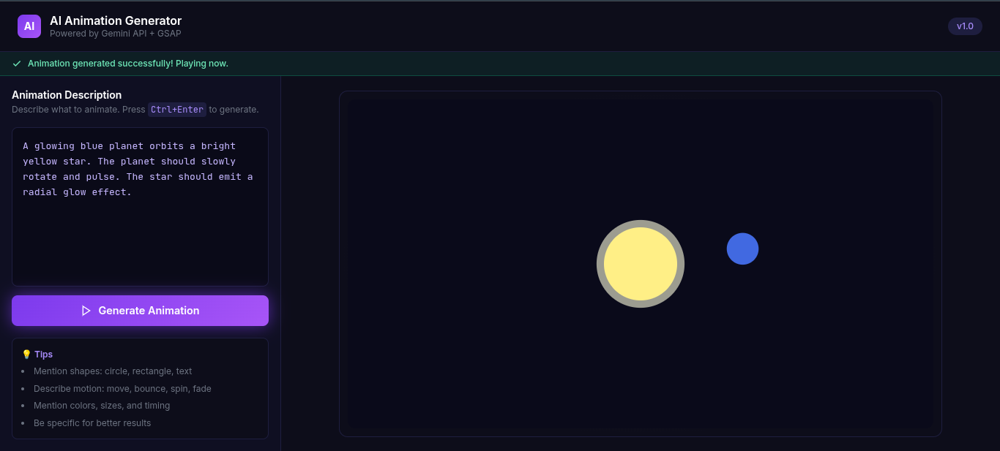
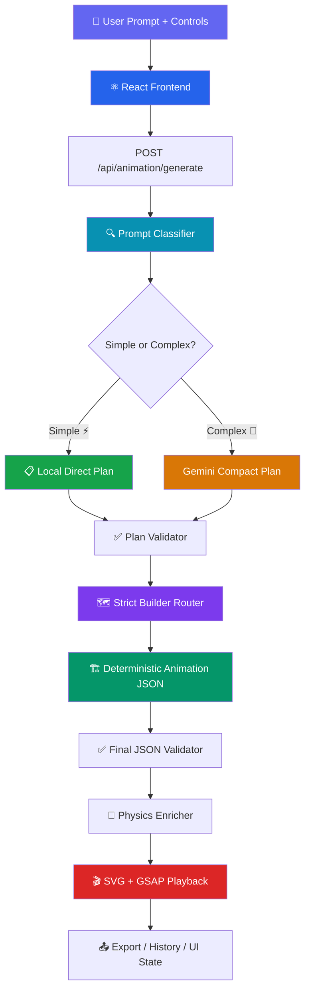
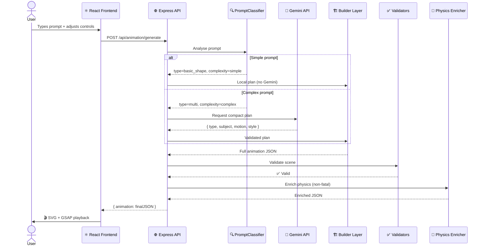

<div align="center">

# ✨ AI 2D Animation Generator
### *Prompt to Motion — Instantly*

<br/>

[](https://github.com/romin711/ANIMATION_ENGINE)
[](https://reactjs.org/)
[](https://vitejs.dev/)
[](https://nodejs.org/)
[](https://expressjs.com/)
[](https://greensock.com/gsap/)
[](https://ai.google.dev/)
[](LICENSE)

<br/>

> **Type a sentence. Watch it animate.**  
> A full-stack system that converts natural-language prompts into validated 2D animation scenes and plays them live in the browser — no design tools, no hand-coded SVG.

<br/>



</div>

---

## 📖 Table of Contents

| # | Section |
|---|---------|
| 1 | [📌 Overview](#-overview) |
| 2 | [🎯 Objectives](#-objectives) |
| 3 | [🧠 Core Concept](#-core-concept) |
| 4 | [🏗️ System Architecture](#️-system-architecture) |
| 5 | [📂 Project Structure](#-project-structure) |
| 6 | [⚙️ How It Works — Step by Step](#️-how-it-works--step-by-step) |
| 7 | [🔍 Deep Code Breakdown](#-deep-code-breakdown) |
| 8 | [🔗 Data Flow Diagram](#-data-flow-diagram) |
| 9 | [🧩 Key Features](#-key-features) |
| 10 | [🛠️ Tech Stack](#️-tech-stack) |
| 11 | [⚡ Design Decisions & Trade-offs](#-design-decisions--trade-offs) |
| 12 | [🚧 Challenges Solved](#-challenges-solved) |
| 13 | [🧪 Example Usage](#-example-usage) |
| 14 | [▶️ Setup & Installation](#️-setup--installation) |
| 15 | [🔮 Future Improvements](#-future-improvements) |
| 16 | [🧾 Closing Summary](#-closing-summary) |

---

## 📌 Overview

This project is a **full-stack prompt-to-animation system** that turns natural language into validated 2D animation scenes rendered live in the browser.

> [!NOTE]
> The system does **not** ask the AI to produce the final animation structure. Instead, it asks for a compact intent plan and then builds the full scene deterministically in backend code — making output reliable, fast, and schema-safe.

**What it does:**

| Step | What happens |
|------|-------------|
| 📝 **Collect** | Accepts a text prompt plus optional visual controls from the browser |
| 🔍 **Classify** | Analyses the prompt locally to decide if it is simple or complex |
| 🤖 **Plan** | Uses Gemini *only* when the prompt is too complex for local handling |
| 🏗️ **Build** | Constructs the final animation JSON deterministically in backend code |
| ✅ **Validate** | Validates and enriches motion with physics before sending to the client |
| 🎬 **Render** | Plays the resulting SVG animation via a GSAP timeline in the browser |

**Real-world use cases:**
- 🚀 Rapid animation prototyping for product demos
- 📚 Learning animation data structures and motion systems
- 🎨 Generating simple motion graphics without hand-authoring SVG timelines
- 🔬 Testing AI-assisted creative workflows with deterministic backend safeguards

---

## 🎯 Objectives

<table>
<tr>
<td width="50%">

**Product Goals**
- ✅ Convert plain English prompts into valid 2D animation scenes
- ✅ Minimise dependency on Gemini for simple prompts
- ✅ Keep the final animation structure deterministic and validator-safe
- ✅ Support repeatable builder routing based on a strict `plan.type`
- ✅ Add physics-based motion enrichment after the scene is already valid
- ✅ Provide runtime visibility through metrics and local audit scripts

</td>
<td width="50%">

**Engineering Goals**
- ✅ Separate intent planning from animation structure generation
- ✅ Keep prompt handling lightweight and deterministic where possible
- ✅ Use local code for layout, timing, and element generation
- ✅ Maintain a small API surface with a single generate endpoint
- ✅ Keep the browser as a renderer and player, not the source of truth for scene logic

</td>
</tr>
</table>

---

## 🧠 Core Concept

> [!IMPORTANT]
> The core architectural shift: **the system never trusts the model to produce the final structure.**

Instead of asking Gemini for a huge nested animation object (which leads to truncation and malformed JSON), the backend asks for a tiny intent plan:

```
{ type, subject, motion, style, complexity }
```

Then **code** decides everything else:

```
how many elements to create  →  where to place them
what animation timelines to attach  →  how to keep output small and valid
```

**The 6-step lifecycle:**

```
① User describes animation in plain language
        ↓
② Backend classifies prompt into a specific animation type
        ↓
③ Simple prompts are handled entirely locally (no AI call)
        ↓
④ Complex prompts go to Gemini for a tiny plan object only
        ↓
⑤ The builder layer turns that plan into the final animation JSON
        ↓
⑥ Validation + physics enrichment run after the scene exists
```

---

## 🏗️ System Architecture

The system is split into **three practical layers:**

```
┌─────────────────────────────────────────────────┐
│  🖥️  Frontend Layer  (React + Vite + GSAP)        │
│      Prompt input · SVG rendering · Playback      │
└─────────────────────┬───────────────────────────┘
                      │  HTTP POST
┌─────────────────────▼───────────────────────────┐
│  ⚙️  Backend Layer  (Node.js + Express)           │
│      Classification · Planning · Building         │
│      Validation · Enrichment · Metrics            │
└─────────────────────┬───────────────────────────┘
                      │  optional
┌─────────────────────▼───────────────────────────┐
│  🤖  AI / Physics Layer                          │
│      Gemini API (compact plans only)             │
│      Physics solvers · Motion generators          │
└─────────────────────────────────────────────────┘
```

### High-Level Request Flow



### Architecture Notes

> [!TIP]
> Each module has a single, clear responsibility. The controller orchestrates but does not implement.

| Module | Role |
|--------|------|
| `server.js` | Express bootstrap and API host |
| `animationController.js` | Orchestration layer — ties the whole backend together |
| `PromptClassifier.js` | Route decision **before** Gemini is used |
| `geminiService.js` | Compact plans **only** for complex prompts |
| `buildAnimationFromPlan.js` | Maps `plan.type` to concrete builders |
| Builder templates | Create the final animation scene deterministically |
| `AnimationEnricher.js` | Optionally upgrades motion after validation |
| React frontend | Only renders and plays the JSON it receives |

---

## 📂 Project Structure

<details>
<summary><strong>📁 Click to expand the full file tree</strong></summary>

```text
ANIMATION_ENGINE/
├── 📄 .gitignore
├── 📄 README.md
├── 📄 documentation.md
├── 📄 LLM_TO_BUILDER_REFACTOR_GUIDE.md
│
├── 🖥️ backend/
│   ├── .env.example
│   ├── package.json
│   ├── server.js                          ← API bootstrap
│   ├── temp.js                            ← local routing audit harness
│   │
│   ├── builders/
│   │   ├── buildAnimationFromPlan.js      ← strict BUILDER_MAP router
│   │   ├── builderUtils.js                ← shared helpers
│   │   └── templates/
│   │       ├── abstractSceneBuilder.js    ← fallback for unknown prompts
│   │       ├── advancedChartSceneBuilder.js
│   │       ├── basicShapeBuilder.js
│   │       ├── bounceSceneBuilder.js
│   │       ├── candlestickBuilder.js
│   │       ├── chartAdvancedBuilder.js
│   │       ├── flowBuilder.js
│   │       ├── floatSceneBuilder.js
│   │       ├── multiBuilder.js
│   │       ├── multiSubjectSceneBuilder.js
│   │       ├── orbitBuilder.js
│   │       ├── particleExplosionBuilder.js
│   │       ├── particleFlowFieldBuilder.js
│   │       ├── skylineBuilder.js
│   │       ├── skylineSceneBuilder.js
│   │       └── textBuilder.js
│   │
│   ├── controllers/
│   │   └── animationController.js         ← main orchestration
│   │
│   ├── physics/
│   │   ├── MotionSolver.js
│   │   ├── OrbitalMechanics.js
│   │   ├── ParticleSystem.js
│   │   ├── PhysicsEngine.js
│   │   ├── Vector2D.js
│   │   └── WaveGenerator.js
│   │
│   ├── processors/
│   │   ├── AnimationEnricher.js
│   │   ├── KeyframeOptimizer.js
│   │   ├── PromptClassifier.js
│   │   └── SceneAnalyzer.js
│   │
│   ├── routes/
│   │   └── animationRoutes.js
│   │
│   ├── schema/
│   │   └── animationPlanSchema.js
│   │
│   ├── services/
│   │   └── geminiService.js
│   │
│   ├── utils/
│   │   ├── MathUtils.js
│   │   └── metrics.js
│   │
│   └── validators/
│       ├── animationPlanValidator.js
│       └── animationValidator.js
│
├── 📸 docs/
│   ├── images/
│   │   ├── SS1.png
│   │   ├── SS2.png
│   │   └── SS3.png
│   └── video/
│       └── video_20260227_160137.mp4
│
├── ⚛️ frontend/
│   ├── index.html
│   ├── package.json
│   ├── postcss.config.js
│   ├── tailwind.config.js
│   ├── vite.config.js
│   └── src/
│       ├── App.jsx                        ← application state & orchestration
│       ├── index.css
│       ├── main.jsx
│       ├── components/
│       │   ├── AnimationCanvas.jsx        ← SVG renderer + GSAP engine
│       │   ├── ControlPanel.jsx           ← prompt input surface
│       │   ├── JSONInputPanel.jsx         ← (unmounted, reserved)
│       │   ├── StatusPanel.jsx            ← (unmounted, reserved)
│       │   └── TopNav.jsx
│       └── services/
│           └── animationService.js        ← API client wrapper
│
└── 🔧 scripts/
    └── evaluateSystem.js                  ← evaluation harness
```

</details>

### Folder Responsibilities at a Glance

| Folder | Purpose |
|--------|---------|
| 🏗️ `backend/builders/` | Converts compact plans into full animation scenes |
| 🧠 `backend/processors/` | Prompt analysis, enrichment, and scene interpretation |
| 🌊 `backend/physics/` | Reusable physics solvers and path generators |
| ✅ `backend/validators/` | Structural validation for plans and final animation JSON |
| 🤖 `backend/services/` | External AI service integration (Gemini) |
| 🔧 `backend/utils/` | Shared helpers and runtime metrics |
| ⚛️ `frontend/` | React/Vite UI — prompt input, canvas rendering, playback |
| 📸 `docs/` | Screenshots and demo assets |
| 🔬 `scripts/` | Evaluation harnesses for classifier and builder coverage |

---

## ⚙️ How It Works — Step by Step



> [!NOTE]
> `JSONInputPanel.jsx` and `StatusPanel.jsx` exist in the repository but are not currently mounted in `App`.

### Important Behavioural Rules

- ⚡ **Simple prompts avoid Gemini entirely** — faster and cheaper
- 🤖 **Complex prompts use Gemini only for planning** — not for final structure
- 🏗️ **The final scene always comes from backend code** — reliable and schema-safe
- 📊 **Fallback behaviour is visible and audited** — logged and counted in metrics

---

## 🔍 Deep Code Breakdown

### 🌐 Backend Entry Points

<details>
<summary><strong><code>backend/server.js</code> — Application bootstrap</strong></summary>

**What it does:**
- Loads environment variables via `dotenv`
- Enables CORS for cross-origin browser access
- Parses JSON requests with a `50kb` size limit
- Exposes `GET /health` for uptime checks
- Mounts `POST /api/animation` routes
- Returns `404` for unknown routes
- Installs a global error handler and process-level safety handlers

**Why it exists:** It is the server boundary — the single entry point for all HTTP traffic.

**How it interacts:** Imports the route module and delegates all animation work to the controller.

</details>

<details>
<summary><strong><code>backend/routes/animationRoutes.js</code> — Route registration</strong></summary>

**What it does:** Registers `POST /generate` and connects it to the controller.

**Why it exists:** Keeps route definition separate from orchestration logic.

</details>

<details>
<summary><strong><code>backend/controllers/animationController.js</code> — Orchestration hub</strong></summary>

**What it does:**
- Validates request fields
- Normalises prompt text
- Classifies prompt type and complexity
- Decides whether Gemini is needed
- Validates plans and output
- Applies requested duration scaling
- Runs final physics enrichment
- Tracks metrics and prints snapshots

**Why it exists:** This is the orchestration layer that ties the whole backend together.

**How it interacts:**
- Uses `PromptClassifier` for route choice
- Uses `geminiService` for complex planning
- Uses `buildAnimationFromPlan` for deterministic scene generation
- Uses both validators and the enricher before responding

</details>

---

### 🔍 Prompt Analysis Layer

<details>
<summary><strong><code>PromptClassifier.js</code> — The routing decision point</strong></summary>

**What it does:**
- Normalises prompts and extracts quoted text
- Detects subject types and motion types using keyword analysis
- Classifies prompts into one of: `basic_shape` · `bounce` · `float` · `particles` · `flow` · `skyline` · `multi` · `candlestick` · `chart_advanced` · `orbit` · `text` · `unknown`
- Returns `complexity: "simple"` or `"complex"`
- Logs the classified type

**Why it exists:** It is the decision point that reduces Gemini usage and makes routing deterministic.

**How it interacts:** Feeds the controller's route decision; provides fallback plan creation through `createIntentPlan()`.

</details>

<details>
<summary><strong><code>SceneAnalyzer.js</code> — Composition heuristics</strong></summary>

**What it does:** Analyses animation JSON and prompt composition hints to infer subject count, motion type, and whether a prompt contains text, particles, skyline, or composite language.

**Why it exists:** Supports richer prompt interpretation for edge cases.

</details>

<details>
<summary><strong><code>AnimationEnricher.js</code> — Physics post-processing</strong></summary>

**What it does:** Enhances validated animation JSON with physics-driven keyframes when applicable. Leaves the original output unchanged if enrichment fails.

**Why it exists:** Adds richer motion without making the generation pipeline fragile.

> [!TIP]
> Enrichment is always **non-fatal** — the validated animation is returned even if enrichment throws.

</details>

<details>
<summary><strong><code>KeyframeOptimizer.js</code> — Timeline compaction</strong></summary>

**What it does:** Reduces redundant or overly dense keyframes to keep animation timelines compact and manageable.

</details>

---

### 🤖 Gemini Planning Layer

<details>
<summary><strong><code>backend/services/geminiService.js</code> — Compact AI planning</strong></summary>

**What it does:**
- Builds a compact prompt for Gemini asking for a **plan, not a scene**
- Parses provider output safely and sanitises all fields
- Retries on retryable provider errors
- Caches plans and fallback results
- Returns fallback metadata (`_fallbackUsed`, `_fallbackReason`)

**Why it exists:** Gemini is used for intent planning only — far safer than asking it to produce the full nested animation object.

**Contract returned:**
```json
{
  "type": "orbit",
  "subject": "planet",
  "motion": "circular",
  "style": "cosmic",
  "complexity": "simple"
}
```

</details>

---

### 🏗️ Builder Layer

<details>
<summary><strong><code>buildAnimationFromPlan.js</code> — Strict builder router</strong></summary>

**What it does:**
- Defines the strict `BUILDER_MAP` (`plan.type` → builder function)
- Validates that `plan.type` exists before dispatching
- Allows `abstractSceneBuilder` **only** for `unknown` type
- Logs `PLAN_TYPE` and `BUILDER_SELECTED` for every request
- Throws on unknown plan types rather than silently falling back

**Why it exists:** It is the core deterministic routing layer that replaces fuzzy or silent builder selection.

</details>

<details>
<summary><strong><code>builderUtils.js</code> — Shared builder helpers</strong></summary>

| Helper | Purpose |
|--------|---------|
| `createPromptHash()` | Deterministic hashing for stable output |
| `getVariantFromPrompt()` | Stable variant selection from hash |
| `clamp()` / `lerp()` | Math helpers for layout and timing |
| `slugify()` | ID generation |
| `createScene()` | Final scene object factory |

</details>

---

### 🎨 Builder Templates

| Builder | Scene Type | Physics Used |
|---------|-----------|--------------|
| `basicShapeBuilder` | Single circle or rect | ❌ |
| `orbitBuilder` | Star + planet orbital | ✅ OrbitalMechanics |
| `textBuilder` | Text reveal | ❌ |
| `bounceSceneBuilder` | Gravity bounce | ✅ PhysicsEngine |
| `floatSceneBuilder` | Smooth floating | ✅ WaveGenerator |
| `particleExplosionBuilder` | Particle burst | ✅ ParticleSystem |
| `particleFlowFieldBuilder` | Flowing particle lanes | ✅ WaveGenerator |
| `multiSubjectSceneBuilder` | Multi-subject composite | ⚡ Optional |
| `skylineSceneBuilder` | Buildings + title | ❌ |
| `advancedChartSceneBuilder` | Chart / dashboard | ❌ |
| `candlestickBuilder` | Financial candle scene | ❌ |
| `abstractSceneBuilder` | Generic fallback | ⚡ Optional |

---

### ✅ Validation Layer

<details>
<summary><strong><code>animationPlanValidator.js</code> — Plan contract enforcement</strong></summary>

**What it does:** Validates compact plans before a builder runs. Checks version, scene type, subject, motion, style, and secondary subject constraints.

> [!WARNING]
> If plan validation fails, the controller rejects the request before any builder is called.

</details>

<details>
<summary><strong><code>animationValidator.js</code> — Final scene contract enforcement</strong></summary>

**What it does:** Validates the final animation scene object, including canvas, elements, and timeline structure.

**Validation happens twice:**
1. After plan creation (before the builder runs)
2. After the builder runs (before enrichment and response)

</details>

---

### 🌊 Physics Layer

| Module | What it provides |
|--------|-----------------|
| `PhysicsEngine.js` | Gravity bounce · spring · pendulum · projectile simulations |
| `OrbitalMechanics.js` | Orbit-related motion paths and keyframes |
| `WaveGenerator.js` | Wave · float · spiral · and other path families |
| `ParticleSystem.js` | Particle burst · float · and rain simulations |
| `MotionSolver.js` | Converts sampled positions into animation keyframes |
| `Vector2D.js` | Immutable 2D vector math (used by all physics modules) |

---

### ⚛️ Frontend Layer

<details>
<summary><strong><code>App.jsx</code> — Application state root</strong></summary>

**What it does:** Owns all application state, merges prompt and controls into a single backend request description, and stores generated animation data and history.

**How it interacts:** Passes props into `ControlPanel`, `TopNav`, and `AnimationCanvas`; calls the API service when the user clicks Generate.

</details>

<details>
<summary><strong><code>ControlPanel.jsx</code> — Primary input surface</strong></summary>

**What it does:** Captures prompt, speed, shape, color, and duration. Shows prompt suggestions and generation status. Stores local history tab items.

**How it interacts:** Calls `onGenerate()` with the current prompt payload; calls `onSelectHistory()` when history items are clicked.

</details>

<details>
<summary><strong><code>AnimationCanvas.jsx</code> — Visual playback engine</strong></summary>

**What it does:**
- Renders the scene as SVG
- Creates and controls a GSAP master timeline
- Supports play, pause, restart, scrubbing, and WebM export

**How it interacts:** Reads `animationData` and builds a timeline from `animationData.timeline`; serialises the SVG into a canvas for browser-side export.

</details>

<details>
<summary><strong><code>TopNav.jsx</code> &amp; <code>animationService.js</code></strong></summary>

**TopNav:** Shows app branding and status chips for idle · loading · success · error states.

**animationService:** Sends a single `POST` request to `/api/animation/generate`. Keeps HTTP logic out of React components.

</details>

---

## 🔗 Data Flow Diagram


---

## 🧩 Key Features

| ✨ Feature | ⚙️ Technical Implementation |
|-----------|---------------------------|
| 🔍 **Prompt classification** | `PromptClassifier.js` analyses keywords, subject hints, motion hints, and composition clues |
| ⚡ **Simple-route bypass** | Simple prompts create direct local plans — Gemini is never called |
| 🤖 **Gemini planning** | `geminiService.js` returns compact plans *only* for complex prompts |
| 🗺️ **Strict builder routing** | `buildAnimationFromPlan.js` maps exact `plan.type` values to builders |
| 🎲 **Deterministic variants** | `builderUtils.getVariantFromPrompt()` selects stable variants using a hash |
| 🌊 **Physics enrichment** | `AnimationEnricher.js` expands motion paths after validation |
| ✅ **Double validation** | Separate validators for the compact plan and final animation JSON |
| 📊 **Runtime metrics** | `utils/metrics.js` tracks requests, Gemini calls, fallbacks, failures, and builder usage |
| 🔬 **Auditability** | `backend/temp.js` and `scripts/evaluateSystem.js` exercise routing and report coverage |
| 🎬 **Frontend playback** | `AnimationCanvas.jsx` converts JSON into GSAP timelines and SVG output |

### Notable Runtime Behaviour

> [!IMPORTANT]
> - `unknown` plan type is the **only** case where the abstract scene builder is used as a fallback
> - Builders print `BUILDER_USED` logs for auditability
> - The controller prints metrics snapshots after each request
> - The system always favours valid local output over waiting for Gemini

---

## 🛠️ Tech Stack

<table>
<tr>
<th>Layer</th>
<th>Technology</th>
<th>Purpose</th>
</tr>
<tr>
<td rowspan="4">🖥️ <strong>Backend</strong></td>
<td></td>
<td>Server runtime</td>
</tr>
<tr>
<td></td>
<td>HTTP API server</td>
</tr>
<tr>
<td></td>
<td>Cross-origin browser access</td>
</tr>
<tr>
<td></td>
<td>Environment variable loading</td>
</tr>
<tr>
<td>🤖 <strong>AI</strong></td>
<td></td>
<td>Compact intent planning for complex prompts</td>
</tr>
<tr>
<td rowspan="5">⚛️ <strong>Frontend</strong></td>
<td></td>
<td>UI framework</td>
</tr>
<tr>
<td></td>
<td>Dev server and build tool</td>
</tr>
<tr>
<td></td>
<td>Animation playback and timeline control</td>
</tr>
<tr>
<td></td>
<td>Utility-first CSS</td>
</tr>
<tr>
<td></td>
<td>Frontend HTTP client</td>
</tr>
<tr>
<td>📤 <strong>Export</strong></td>
<td></td>
<td>Browser-side video export</td>
</tr>
<tr>
<td>📄 <strong>Docs</strong></td>
<td></td>
<td>Architecture and flow diagrams</td>
</tr>
</table>

---

## ⚡ Design Decisions & Trade-offs

### Decision Matrix

| Decision | Benefit | Trade-off |
|----------|---------|-----------|
| 🤖 **Gemini for planning only** | Eliminates truncation and malformed JSON risk | Requires a robust local builder layer |
| 🏗️ **Builders own final structure** | Scene shape, timing, IDs deterministic | Builder templates must be maintained per type |
| ⚡ **Simple prompts skip Gemini** | Faster latency, lower provider cost | Requires an accurate classifier |
| 📢 **Explicit fallbacks** | Nothing is hidden; logged and counted | Slightly more verbose logging |
| ✅ **Double validation** | Catches bad plans AND bad output | Two validation steps add minor overhead |
| 📊 **In-memory metrics** | Fast and zero-dependency | Resets on process restart |
| 🖥️ **Frontend is a renderer only** | Browser logic stays simple and focused | UI controls are merged into description string |

### Current Limitations

> [!WARNING]
> - No database or persistent storage — history is in-memory only
> - Metrics reset on process restart
> - Legacy frontend components (`JSONInputPanel`, `StatusPanel`) exist but are not mounted
> - Some UI controls are merged into the description string but are not consumed separately by the backend

---

## 🚧 Challenges Solved

| 🔴 Challenge | 🟢 How the Project Addresses It |
|-------------|--------------------------------|
| Large or truncated LLM JSON | Gemini returns **only a compact plan** — never the full scene |
| Too many Gemini calls | Simple prompts **bypass Gemini completely** |
| Hidden fallback behaviour | Fallbacks are **logged and counted** explicitly |
| Builder ambiguity | `BUILDER_MAP` enforces **strict type-to-builder routing** |
| Invalid scene output | Final animation JSON is **validated before response** |
| Slow / brittle motion generation | Physics enrichment is **post-processing** — not generation-critical |
| Unclear runtime behaviour | Audit scripts print **classification, builder usage, and fallback** |

---

## 🧪 Example Usage

### Example 1 — Simple Shape Prompt

**Input:**
```
A red square spinning continuously
```

**Pipeline trace:**
```
🔍 Classifier  →  type: basic_shape  |  complexity: simple
⚡ Gemini       →  SKIPPED
🏗️ Builder     →  basicShapeBuilder
✅ Validator   →  PASS
🎬 Output      →  SVG rect with GSAP rotate timeline
```

---

### Example 2 — Orbit Prompt

**Input:**
```
A blue planet orbiting a bright yellow star
```

**Pipeline trace:**
```
🔍 Classifier  →  type: orbit  |  complexity: simple
⚡ Gemini       →  SKIPPED
🏗️ Builder     →  orbitBuilder (uses OrbitalMechanics)
✅ Validator   →  PASS
🎬 Output      →  SVG star + planet with circular keyframe timeline
```

---

### Example 3 — Complex Creative Prompt

**Input:**
```
A cinematic futuristic city with floating neon particles
```

**Pipeline trace:**
```
🔍 Classifier  →  type: skyline / multi  |  complexity: complex
🤖 Gemini       →  { type: "skyline", subject: "city", motion: "float", style: "neon" }
🏗️ Builder     →  skylineSceneBuilder + particleFlowFieldBuilder
✅ Validator   →  PASS
🌊 Enricher    →  physics motion upgrade applied
🎬 Output      →  Multi-element SVG scene with GSAP timeline
```

---

### Example 4 — Routing Audit

Run the local audit harness to verify classifier and builder wiring:

```bash
cd backend
node temp.js
```

**What it prints:**
```
[PROMPT_CLASSIFIER] type: orbit
[BUILDER_SELECTED]  orbitBuilder
[GEMINI_USED]       false
[FALLBACK_USED]     false
[PLAN_VALID]        true
[OUTPUT_VALID]      true
[BUILDER_USAGE]     { orbitBuilder: 1, ... }
```

---

### Example Success Response Shape

```json
{
  "animation": {
    "version": "1.0",
    "canvas": {
      "width": 800,
      "height": 450,
      "background": "#1a1a2e"
    },
    "elements": [
      {
        "id": "square-1",
        "type": "rect",
        "x": 300, "y": 180,
        "width": 120, "height": 120,
        "fill": "#ef4444",
        "opacity": 1
      }
    ],
    "timeline": [
      {
        "id": "spin-1",
        "target": "square-1",
        "type": "rotate",
        "from": { "rotation": 0 },
        "to": { "rotation": 360 },
        "duration": 2,
        "delay": 0,
        "ease": "power2.inOut",
        "repeat": -1,
        "yoyo": false
      }
    ]
  }
}
```

---

## ▶️ Setup & Installation

### Prerequisites

| Requirement | Version |
|-------------|---------|
|  | 18 or newer |
|  | 9 or newer |
| Gemini API Key | Required for complex prompts |

---

### Step 1 — Clone the Repository

```bash
git clone https://github.com/romin711/ANIMATION_ENGINE.git
cd ANIMATION_ENGINE
```

### Step 2 — Install Backend Dependencies

```bash
cd backend
npm install
```

### Step 3 — Configure Environment

Create `backend/.env`:

```env
# ── Required ────────────────────────────────────────
GEMINI_API_KEY=your_gemini_api_key
PORT=5000
NODE_ENV=development

# ── Optional tuning ─────────────────────────────────
GEMINI_MODEL=gemini-2.5-flash
GEMINI_TIMEOUT_MS=60000
GEMINI_MAX_RETRIES=2
GEMINI_PLAN_MAX_OUTPUT_TOKENS=256
GEMINI_PLAN_TEMPERATURE=0.1
GEMINI_TOP_P=0.7
```

### Step 4 — Install Frontend Dependencies

```bash
cd ../frontend
npm install
```

### Step 5 — Run Both Servers

**Terminal 1 — Backend:**
```bash
cd backend
npm run dev
```

**Terminal 2 — Frontend:**
```bash
cd frontend
npm run dev
```

### Step 6 — Open the Application

| Service | URL |
|---------|-----|
| 🖥️ Frontend | <http://localhost:5173> |
| ❤️ Backend health | <http://localhost:5000/health> |
| 🌐 Generate API | <http://localhost:5000/api/animation/generate> |

---

### Optional: Run Audit and Evaluation Scripts

```bash
# Quick routing audit (classifier + builder wiring)
cd backend && node temp.js

# Larger evaluation harness
node scripts/evaluateSystem.js
```

---

## 🔮 Future Improvements

| 🚀 Improvement | 💡 Why It Would Help |
|----------------|---------------------|
| 🧪 Automated tests | Catch routing and builder regressions earlier |
| 💾 Persisted metrics | Survive process restarts for long-term usage tracking |
| 🏷️ Unified naming cleanup | Reduce mismatch between docs, builders, and UI copy |
| 🎛️ UI control → backend mapping | Make speed/shape/color controls meaningful server-side |
| 📋 Stronger schema versioning | Simplify future changes to the planning contract |
| 🎨 More template builders | Expand the library of deterministic scenes |
| 📤 Export hardening | More robust WebM export across browsers |
| 🧹 Legacy component cleanup | Remove stale UI files that are no longer mounted |
| 🔗 Centralised documentation tests | Keep README and guides aligned with code over time |
| 🐳 Docker support | One-command local startup |
| 🔐 Authentication + workspaces | User accounts and saved project history |

---

## 🧾 Closing Summary

> [!NOTE]
> This is not a generic prompt-to-image toy.

It is a **structured animation generation system** with a deliberate separation of concerns:

```
🖥️  Frontend   → collects input, renders SVG, controls GSAP playback
🔍  Classifier → decides the route deterministically
🤖  Gemini     → handles intent planning for complex prompts only
🏗️  Builders   → own all final scene structure
✅  Validators → protect correctness at two checkpoints
🌊  Physics    → enriches motion after the scene is already valid
📊  Metrics    → make the system observable at runtime
```

That architecture is what makes this project **technically interesting and production-friendly.**

---

<div align="center">

[](https://github.com/romin711/ANIMATION_ENGINE)
[](https://github.com/romin711)
[](https://github.com/romin711/ANIMATION_ENGINE)

*Made with ❤️ by [Romin Kevadiya](https://github.com/romin711)*

</div>
